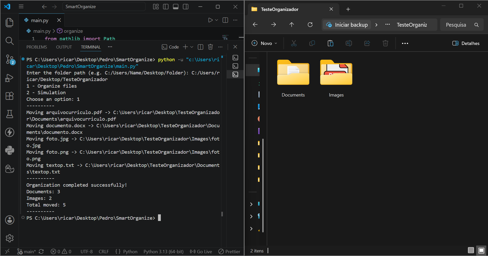

<h1 align="center">SmartOrganize</h1>

<p align="center">
  
  
  
</p>

A command-line application written in Python that automatically organizes files into categorized folders based on their extensions. The project includes a simulation mode, automatic folder creation, and duplicate filename handling to safely organize directories.

## Preview

### Demo


### Screenshot



### Features

-   Organize files by extension
-   Simulation (dry-run) mode before moving files
-   Automatic folder creation
-   Duplicate filename handling (`file (1).ext`)
-   Modern file handling with `pathlib`
-   Safe file moving with `shutil`
-   Clean and modular codebase

## Simulation Mode

Before moving any file, the application can simulate the organization process and display every planned action. This allows the user to verify the result before confirming the operation.

## Supported Categories

- **Images:** `.png`, `.jpg`, `.jpeg`, `.gif`, `.bmp`, `.webp`
- **Documents:** `.pdf`, `.doc`, `.docx`, `.txt`, `.md`, `.rtf`
- **Spreadsheets:** `.xls`, `.xlsx`, `.csv`
- **Presentations:** `.ppt`, `.pptx`
- **Music:** `.mp3`, `.wav`, `.flac`
- **Videos:** `.mp4`, `.mkv`, `.avi`, `.mov`
- **Archives:** `.zip`, `.rar`, `.7z`
- **Others:** Any unsupported extension

## Technologies

-   Python 3
-   pathlib
-   shutil

## Requirements

- Python 3.13+
- Windows, Linux or macOS

## Project Structure

``` text
SmartOrganize/
│
├── main.py
├── README.md
├── LICENSE
└── .gitignore
```

## Installation

``` bash
git clone https://github.com/PedrReis-create/SmartOrganize.git
cd SmartOrganize
python main.py
```

## Example

### Before

``` text
Downloads/
├── photo.jpg
├── report.pdf
├── music.mp3
├── video.mp4
└── notes.txt
```

### After

``` text
Downloads/
├── Images/
│   └── photo.jpg
├── Documents/
│   ├── report.pdf
│   └── notes.txt
├── Music/
│   └── music.mp3
├── Videos/
│   └── video.mp4
└── Others/
```

## Future Improvements

-   [ ] Command-line arguments with `argparse`
-   [ ] Recursive folder organization
-   [ ] Logging support
-   [ ] Undo last organization
-   [ ] Configuration file
-   [ ] Unit tests with `pytest`

## Why I built this project

I created this project to improve my Python skills by practicing file manipulation, modular code organization, and modern filesystem handling using `pathlib` and `shutil`.

The goal was to build a simple but reliable command-line application following Clean Code principles.

## License

Distributed under the MIT License.